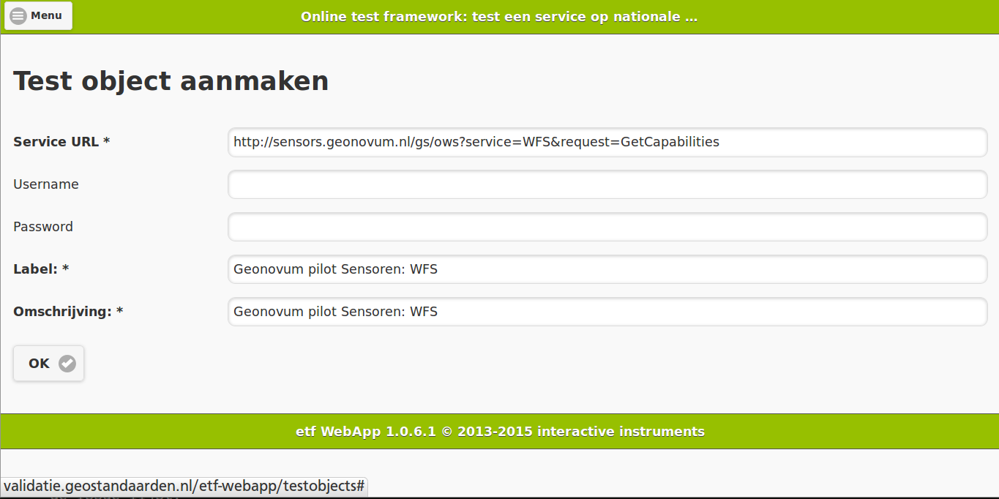
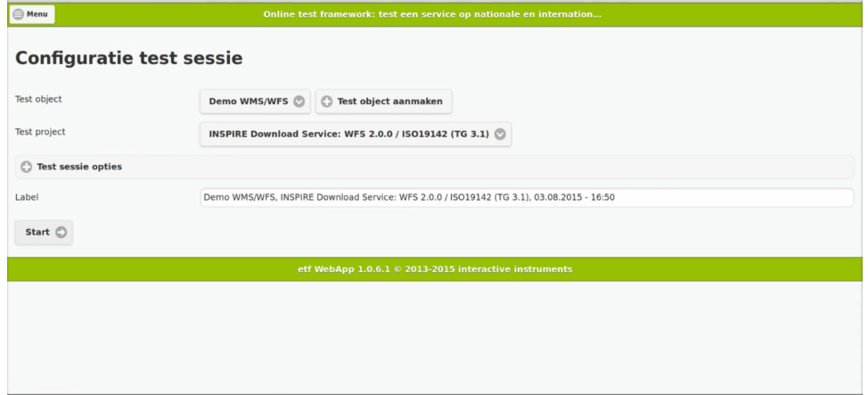

# Online ETF validator voor services
Voor het testen van geo-webservices (als WMS, WFS, Atom) op INSPIRE eisen en Nederlandse profielen, is in Nederland het ETF in gebruik. Er is al enkele jaren een desktop versie van deze test software, die gebruik maakt van [SoapUI](http://www.soapui.org/). Zie [de Geonovum website voor meer informatie over het ETF](http://www.geonovum.nl/validator-inspire-view-en-downloadservices). Inmiddels is er ook een online ETF validator beschikbaar.

## De online validator gebruiken
De online validator is via [http://validatie.geostandaarden.nl/](http://validatie.geostandaarden.nl/) en [http://validatie.geostandaarden.nl/etf-webapp/testobjects](http://validatie.geostandaarden.nl/etf-webapp/testobjects) te benaderen.

Het testen van een service gaat als volgt:

1) Na het openen van de validator, verschijnt een scherm om **een test object (een service) te configureren** om zo meteen te gaan testen. Maak een test object aan, als de service niet in de lijst staat. Dit bestaat in ieder geval uit de service URL en een verplichte beschrijving en label voor de service. Optioneel kan een username/password opgegeven worden als de service HTTP Authenticatie vereist. Voor WMS en WFS is de service URL de GetCabilities URL, voor INSPIRE Download Services via Atom feeds is het de Service feed URL. Op dit moment worden de testobjecten standaard opgeslagen in de online validator voor later hergebruik.

2) **Start test**. Kies de service uit de lijst met bestaande test objecten en kies op welke standaard getest moet worden via de test projecten. Indien gewenst, pas de beschrijving van de test aan en kies Start. Voor sommige tests zijn er nog geavanceerde opties beschikbaar via "Test sessie opties".

3) **De test draait**. In een scherm is de voortgang en log-informatie te zien. Een test kan enkele minuten duren.

## Testrapport
4) Na afronding verschijnt **het testrapport**. Met per controle informatie over het slagen of falen ervan. Daarin zijn meer en minder details op te vragen, via de opties in de rechterboven hoek.

Een testrapport bevat de resultaten ingedeeld in de volgende hiërarchie / groepering:

1. **Test suites**: dit is een hoofdonderwerp van een test. Een Test suite bevat één of meerdere test cases. De test suits zijn voor bepaalde tests onderverdeeld in de verplichte en optionele of conditionele onderdelen van een test.
2. **Test cases**: een test case is een onderdeel van een Test suite, om een bepaald aspect (zoals een ISO conformance class) te testen. Een Test case bevat op haar beurt weer één of meerdere Tests Steps.
3. **Test step**: een test step is een onderdeel van een test case waarin een afgebakend deel getest wordt. Bijvoorbeeld: of de response van een bepaald request voldoet. Vaak zijn er meerdere Test steps om te bepalen of aan een Test case voldaan is.
4. **Assertions**: in een Test step zitten Assertions. Dit zijn hele **specifieke controles**, om te testen of iets voldoet of niet. Bijvoorbeeld of een waarde wel of niet aanwezig is in een response.

Als een Assertion faalt, dan faalt de Test step waarin de Assertion zit, vervolgens de Test case waar de Test step onder valt en daarmee ook de Test suite waar de Test step onderdeel van is.

Via het menu (linksboven) zijn nog andere functies beschikbaar, zoals het raadplegen van oude test rapporten.

Er zijn wat beperkingen, zoals dat test rapporten momenteel altijd blijven bestaan (wel handmatig te verwijderen). Deze beperkingen staan in de issue-lijst.

## Demonstratie video
Op [https://vimeo.com/139188974](https://vimeo.com/139188974) is een korte demonstratie video te zien van het testen van een service via het online ETF.

## Issues melden
Komt u een probleem tegen? Raadpleeg dan de [issue-lijst](https://github.com/Geonovum/etf-test-projects-nl/issues) voor de bekende problemen en voeg desgewenst informatie toe. Staat het issue er niet tussen, maak dan via de [issue-lijst](https://github.com/Geonovum/etf-test-projects-nl/issues) een nieuw issue aan. Issues en opmerkingen graag in het Nederlands of Engels.

## Meer informatie

- [Conformiteits toetsen van Geonovum](http://www.geonovum.nl/wegwijzer/validatie)
